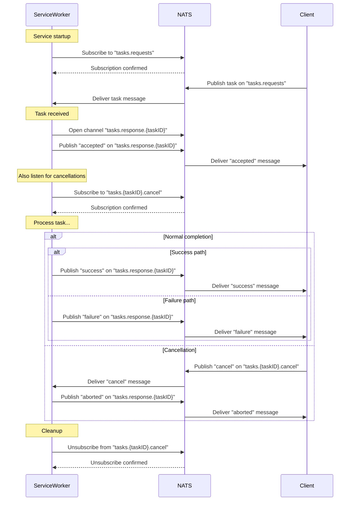
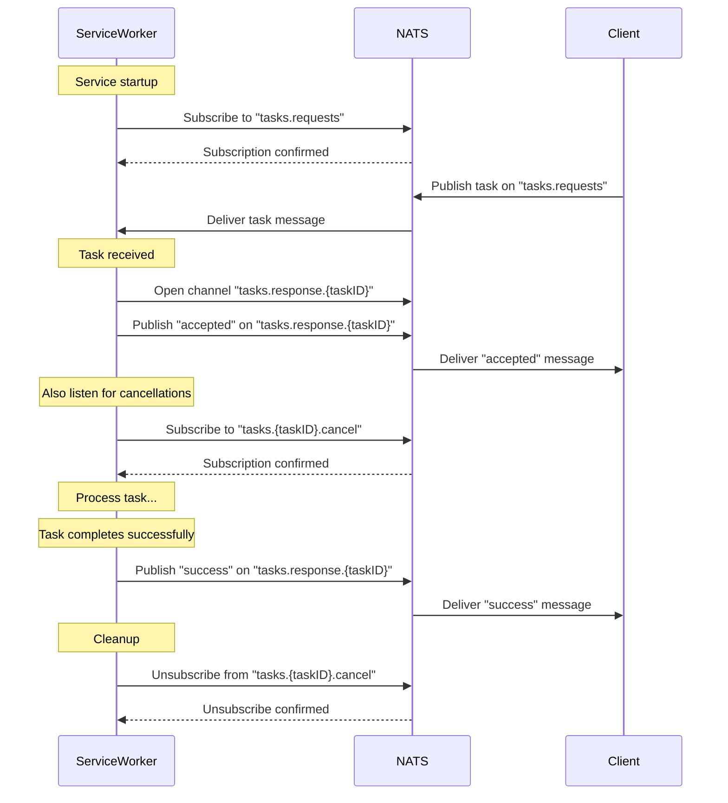

```mermaid
sequenceDiagram
    participant ServiceWorker
    participant NATS
    participant Client
    
    Note over ServiceWorker: Service startup
    ServiceWorker->>NATS: Subscribe to "tasks.requests"
    NATS-->>ServiceWorker: Subscription confirmed
    
    Client->>NATS: Publish task on "tasks.requests"
    NATS->>ServiceWorker: Deliver task message
    
    Note over ServiceWorker: Task received
    ServiceWorker->>NATS: Open channel "tasks.response.{taskID}"
    ServiceWorker->>NATS: Publish "accepted" on "tasks.response.{taskID}"
    NATS->>Client: Deliver "accepted" message
    
    Note over ServiceWorker: Also listen for cancellations
    ServiceWorker->>NATS: Subscribe to "tasks.{taskID}.cancel"
    NATS-->>ServiceWorker: Subscription confirmed
    
    Note over ServiceWorker: Process task...
    
    alt Normal completion
        alt Success path
            ServiceWorker->>NATS: Publish "success" on "tasks.response.{taskID}"
            NATS->>Client: Deliver "success" message
        else Failure path
            ServiceWorker->>NATS: Publish "failure" on "tasks.response.{taskID}"
            NATS->>Client: Deliver "failure" message
        end
    else Cancellation
        Client->>NATS: Publish "cancel" on "tasks.{taskID}.cancel"
        NATS->>ServiceWorker: Deliver "cancel" message
        ServiceWorker->>NATS: Publish "aborted" on "tasks.response.{taskID}"
        NATS->>Client: Deliver "aborted" message
    end
    
    Note over ServiceWorker: Cleanup
    ServiceWorker->>NATS: Unsubscribe from "tasks.{taskID}.cancel"
    NATS-->>ServiceWorker: Unsubscribe confirmed
```

# Success

```mermaid
sequenceDiagram
    participant ServiceWorker
    participant NATS
    participant Client
    
    Note over ServiceWorker: Service startup
    ServiceWorker->>NATS: Subscribe to "tasks.requests"
    NATS-->>ServiceWorker: Subscription confirmed
    
    Client->>NATS: Publish task on "tasks.requests"
    NATS->>ServiceWorker: Deliver task message
    
    Note over ServiceWorker: Task received
    ServiceWorker->>NATS: Open channel "tasks.response.{taskID}"
    ServiceWorker->>NATS: Publish "accepted" on "tasks.response.{taskID}"
    NATS->>Client: Deliver "accepted" message
    
    Note over ServiceWorker: Also listen for cancellations
    ServiceWorker->>NATS: Subscribe to "tasks.{taskID}.cancel"
    NATS-->>ServiceWorker: Subscription confirmed
    
    Note over ServiceWorker: Process task...
    
    Note over ServiceWorker: Task completes successfully
    ServiceWorker->>NATS: Publish "success" on "tasks.response.{taskID}"
    NATS->>Client: Deliver "success" message
    
    Note over ServiceWorker: Cleanup
    ServiceWorker->>NATS: Unsubscribe from "tasks.{taskID}.cancel"
    NATS-->>ServiceWorker: Unsubscribe confirmed
```

foreverbull.backtest.backtest.create.<ID>.command.[START|ABORT]
foreverbull.backtest.backtest.create.<ID>.state.[RECIEVED|COMPLETED|ABORTED]

foreverbull.backtest.execution.